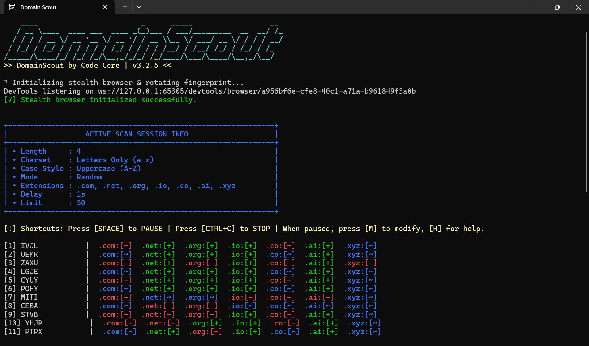

<p align="center">
  
</p>

<h1 align="center">DomainScout</h1>

<p align="center">
  <b>A professional, multi-extension domain availability checker and automated hunter.</b>
</p>

<p align="center">
  
  
  
</p>

---

## 📸 Preview

<p align="center">
  
</p>

---

## ✨ Key Capabilities

- **Stealth Automation**: Simulates organic browser fingerprints with dynamic User-Agent rotation and WebDriver evasion scripts.
- **Multi-Extension Batch Scanning**: Checks multiple top-level domains (TLDs) concurrently per keyword iteration.
- **Interactive TUI**: Real-time process control with live keyboard shortcuts (`SPACE` to pause, `M` to modify parameters on-the-fly).
- **Unified Master Logging**: Automatically categorizes and logs domain statuses (`AVAILABLE`, `TAKEN`, `AFTERMARKET`, `PREMIUM`) with customizable timestamp templates.
- **System Diagnostics Hub**: Built-in health checker for configuration files and logs, complete with manual repair and cleanup tools.

---

## 🗂️ Project Architecture

```text
DomainScout/
│
├── assets/
│   ├── logo.png              # Application logo
│   ├── logo.ico              # Windows shortcut icon
│   └── screenshot.png        # TUI preview screenshot
├── code.py                   # Core application entry point
├── config.json               # Local configuration parameters (auto-generated)
├── domain_scout_master.log   # Unified scan results ledger
├── domain_scout_error.log    # Silent runtime exception tracker
├── CHANGELOG.md              # Detailed version history
└── README.md                 # Project documentation
```

## ⚡ Instant Installation (Windows PowerShell)

You can install and run DomainScout instantly using PowerShell:
```PowerShell
irm bit.ly/domainscout | iex
```

## ⚙️ Prerequisites

Ensure you have **Python 3.8+** installed along with the **Google Chrome** browser.

Required Python packages can be installed via pip:
```bash
pip install selenium beautifulsoup4 questionary keyboard
```

## Quick Start
1. Clone the repository:
   ```bash
   git clone https://github.com/codekere/domain-scout.git
   cd domain-scout
   ```
2. Run the application:
   ```bash
   python code.py
   ```

On first execution, default configurations will be automatically generated. You can customize scan rules (length, character sets, extensions, delays) directly from the interactive Settings & Configuration menu.

## TUI Shortcuts & Controls
* **SPACE** : Instantly pause or resume the hunting loop.
* **M (When paused)** : Open the live settings modification overlay.
* **H (When paused)** : Display helper and legend index.
* **S (During recheck)** : Safely abort log rechecking and return to menu.
* **CTRL + C** : Safe shutdown and memory cleanup.

## Status Legend
* **[+]** : Available (Free to register)
* **[-]** : Taken (Already registered)
* **[~]** : Aftermarket (Listed for sale / broker)
* **[*]** : Premium (High-value pricing tier)

## License
Distributed under the MIT License. See LICENSE for more information.